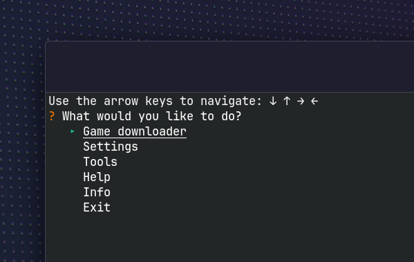
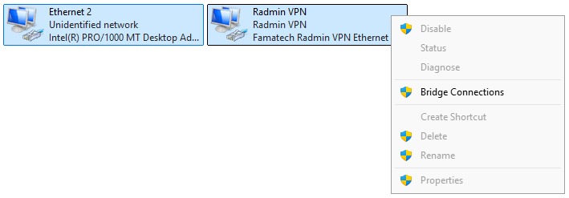

# Downloader



A R6S downloader and manager for **Operation Throwback** and **Heated Metal** (Rainbow Six Siege) on Linux.

<br>

### 📋 Requirements

- Native Steam (no Flatpak, no Snap)
- A Steam account that owns Tom Clancy’s Rainbow Six® Siege

<br>

### 🔧 Installation

1. Open a terminal and run

   ```
   bash <(curl -sS https://raw.githubusercontent.com/Xeralin/Downloader/main/install.sh)
   ```

2. Run `downloader` to launch it again

> Prefer to do it manually? <br>
> Grab the **downloader** file from the [latest release](https://github.com/Xeralin/Downloader/releases) and run `chmod +x downloader && ./downloader`.

<br>

### 🍿 Usage

Pick a season from the **Game downloader** option and log in with your Steam account. The season will then be downloaded to `~/.local/share/Downloader/data/downloads/`.

**Automatic (recommended)**

1. Confirm *Add to Steam?* at the end of the download
2. Close Steam completely and pick a compatibility layer
3. Downloader adds the entry to your Steam library
4. Open Steam and click *Play*

**Manual**

1. Open Steam > Games > Add a Non-Steam Game > Browse
2. Inside `~/.local/share/Downloader/data/downloads/<season>/`, select `LaunchR6S.exe`
3. Right-click the entry > Properties, then
   - General > uncheck *Enable the Steam Overlay while in-game*
   - Compatibility > enable *Force the use of a specific Steam Play tool* and pick a compatibility layer

<br>

### 🌐 RadminVPN

Unfortunately, RadminVPN is only available for Windows. To join a RadminVPN network on Linux, we need a bridge. If you don't need RadminVPN, you can use native programs like [ZeroTier](https://www.zerotier.com/).

**Using a virtual machine (recommended)**

1. Use [VirtualBox](https://www.virtualbox.org/) to create a virtual machine running Windows, on which you install RadminVPN
2. Tools > RadminVPN > Create bridge > Enter your own RadminVPN IP address here
3. Shut down your VM and run Tools > RadminVPN > Attach VM to bridge
4. In Windows, open `ncpa.cpl`, select the Ethernet 2 host-only adapter and the Radmin VPN adapter > right-click > Bridge Connections

**Using a second Windows PC**

1. Connect both machines with an Ethernet cable
2. On Linux, replace `<iface>` with your Ethernet adapter (find with `ip -br link`) and `<radmin-ip>` with your RadminVPN IP, then run this command:
   ```bash
   IFACE=<iface>
   IP=<radmin-ip>

   sudo ip addr add $IP/8 dev $IFACE
   sudo ip link set $IFACE up
   sudo ip route add 224.0.0.0/4 dev $IFACE
   sudo ip route add 26.255.255.255/32 dev $IFACE
   sudo ip route add 255.255.255.255/32 dev $IFACE
   ```
3. On the second PC, open `ncpa.cpl`, select the Ethernet adapter and the Radmin VPN adapter > right-click > Bridge Connections

<br>

The network bridge on both Linux and Windows does not survive a reboot. RadminVPN shows *waiting for adapter response* or fails to create the bridge and displays the error *An unexpected error occurred while configuring the Network Bridge*. Delete the Network Bridge in `ncpa.cpl` and bridge the adapters again.

