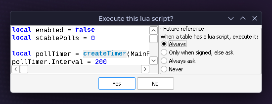

# Mila

**M**ila **I**s **L**inux **A**pproved


A CLI downloader and manager for Rainbow Six Siege **Throwback** and **Heated Metal** on Linux.

## Requirements

- Native Steam (no Flatpak, no Snap)
- Python 3.11 or newer
- A Steam account that owns Rainbow Six Siege

## Installation

1. Download and extract the **Mila.zip** from the [latest release](https://github.com/Xeralin/Mila/releases)
2. Open a terminal in the extracted folder and run `python main.py`
3. Have fun :)

> [!NOTE]
> When a newer release is available, the **Info** screen offers to update and restart in place. If you cloned the repo with git, run `git pull` instead.

## Usage

Pick a season from the **Game downloader** option and log in with your Steam account. The season will then be downloaded to the `downloads/` folder.

### Automatic (recommended)

1. Confirm *Add to Steam?* at the end of the download
2. **Close Steam** and pick a compatibility layer
3. Mila adds the entry to your Steam library
4. Open Steam and click *Play*

### Manual

1. Open Steam > Games > Add a Non-Steam Game > Browse
2. Inside `downloads/<season>/`, select `LaunchR6.bat` (Throwback) or `RainbowSix.exe` (Heated Metal)
3. Right-click the entry > Properties, then
   - General > uncheck *Enable the Steam Overlay while in-game*
   - Compatibility > enable *Force the use of a specific Steam Play tool* and pick a compatibility layer

> [!IMPORTANT]
> Mila downloads the season files directly from Steam, so you log in with a Steam account that owns Rainbow Six Siege. Your password is never stored — DepotDownloader keeps only an encrypted access token, just like the Steam client. To log out, open Help > *Does my Steam login get stored?* > Log out.

> [!NOTE]
> Unfortunately, Linux does not currently support Heated Metal on Y9S2 New Blood. Tools like Liberator don't work either.

## Unlock-All

Unlock-All requires Cheat Engine. [Download](https://cheatengine.org) the Windows version, move it to `bin/` and rename it to `CheatEngine.exe`!

| Season | Name          |
|--------|---------------|
| Y2S4   | White Noise   |
| Y5S3   | Shadow Legacy |
| Y5S4   | Neon Dawn     |
| Y6S2   | North Star    |
| Y7S2   | Vector Glare  |
| Y7S4   | Solar Raid    |

When downloading a supported season, confirm *Enable Unlock-All?* at the download prompt. Click through the Cheat Engine installer window when it opens — **deny any bundled offers** to avoid adware.

> [!NOTE]
> **First run:** Tick *Always* on the Lua script prompt, click **Yes**, and restart the game once. The Unlock-All enables 7 seconds after Cheat Engine attaches to the game.
>
> 

**Y7S4 and Y7S2 also require a plugin, which you can add as follows:**

1. Go to Edit > Settings > Plugins
2. Click *Add New*
3. In the file dialog, navigate to `/` drive > `home/<user>/.../Mila/plugins/stealthedit/umstealthedit-x86_64.dll`
4. Make sure the checkbox is checked
5. Click OK

**To add a custom cheat table, follow these steps:**

1. Drop your `<filename>.CT` file into `plugins/ct`
2. Open your file with an text editor
3. Between `<UserdefinedSymbols/>` and `</CheatTable>`, add the following `Lua script` block

<details>
<summary>Lua script</summary>

```lua
  <LuaScript>local enabled = false
local stablePolls = 0

local pollTimer = createTimer(MainForm)
pollTimer.Interval = 200
pollTimer.OnTimer = function(t)
  if enabled then
    timer_setEnabled(t, false)
    return
  end

  local newestPid = 0
  for pid, name in pairs(getProcessList()) do
    if name:find("^RainbowSix") then
      local n = tonumber(pid)
      if n and n &gt; newestPid then newestPid = n end
    end
  end
  if newestPid == 0 then
    stablePolls = 0
    return
  end

  if getOpenedProcessID() ~= newestPid then
    openProcess(newestPid)
    stablePolls = 0
    return
  end

  stablePolls = stablePolls + 1
  if stablePolls &lt; 35 then return end

  for i = 0, AddressList.Count - 1 do
    local mr = AddressList.getMemoryRecord(i)
    if mr and mr.Type == vtAutoAssembler then
      mr.Active = true
      break
    end
  end
  enabled = true
  timer_setEnabled(t, false)
end
</LuaScript>
```

</details>

4. Add `ct = "<filename>.CT"` to the season's block in `manifest.toml`
5. If the season is already in `downloads/`, toggle **Unlock-All** in *Settings* to refresh `LaunchR6.bat`

## RadminVPN

Unfortunately, RadminVPN is only available for Windows. To join a RadminVPN network on Linux, we need a bridge. If you don't need RadminVPN, you can use native programs like [ZeroTier](https://www.zerotier.com/).

### Using a virtual machine (recommended)

1. Use [VirtualBox](https://www.virtualbox.org/) to create a virtual machine running Windows, on which you install RadminVPN
2. Tools > RadminVPN > Create bridge > Enter your own RadminVPN IP address here
3. Shut down your VM and run Tools > RadminVPN > Attach VM to bridge
4. In Windows, open `ncpa.cpl`, select the Ethernet 2 host-only adapter and the Radmin VPN adapter > right-click > Bridge Connections

### Using a second Windows PC

1. Connect both machines with an Ethernet cable
2. On Linux, replace `<iface>` with your Ethernet adapter (find with `ip -br link`) and `<radmin-ip>` with your RadminVPN IP, then run this command:
   ```bash
   IFACE=<iface>
   IP=<radmin-ip>

   sudo ip addr add $IP/8 dev $IFACE
   sudo ip link set $IFACE up
   sudo ip route add 224.0.0.0/4 dev $IFACE
   sudo ip route add 26.255.255.255/32 dev $IFACE
   sudo ip route add 255.255.255.255/32 dev $IFACE
   ```
3. On the second PC, open `ncpa.cpl`, select the Ethernet adapter and the Radmin VPN adapter > right-click > Bridge Connections

> [!NOTE]
> **Linux:** The bridge does not survive a reboot. Go to Tools > RadminVPN > Create bridge.
>
> **Windows:** The bridge breaks if you restart your system (RadminVPN shows *waiting for adapter response*) or fails to create (Windows shows *An unexpected error occurred while configuring the Network Bridge.*). Delete the Network Bridge in `ncpa.cpl` and bridge the adapters again — it's bound to work eventually.
>
> 
